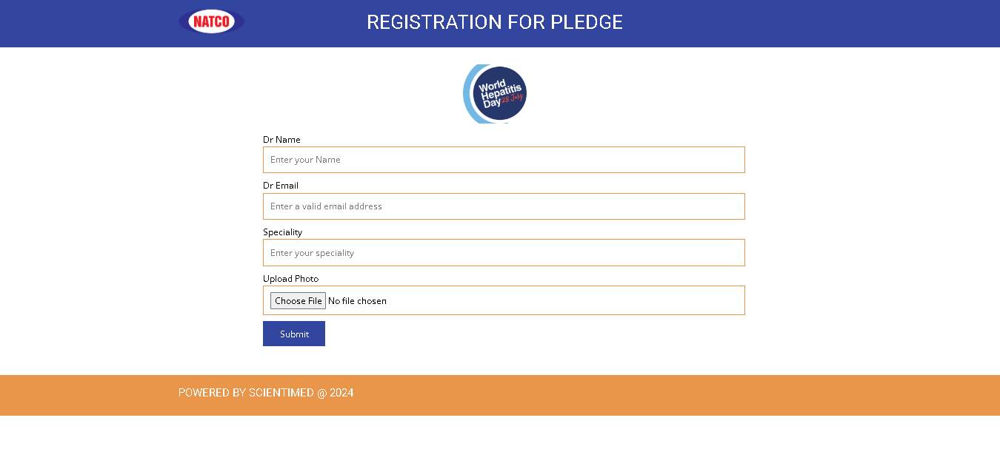
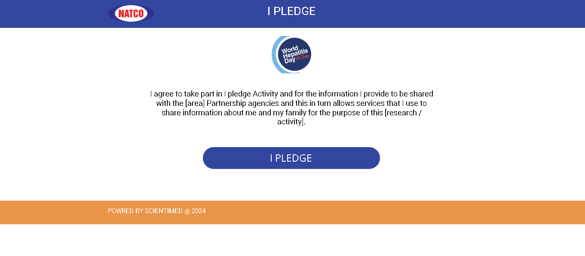
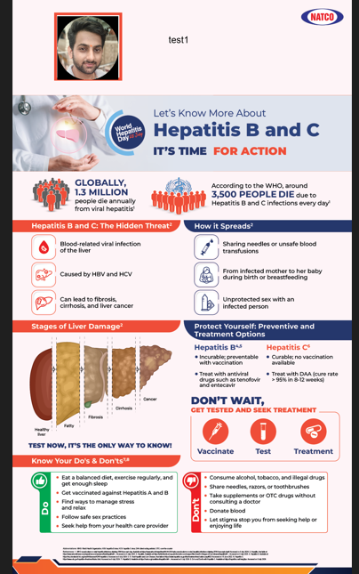

# TechPledge






## Overview

TechPledge is a Laravel-based application that provides a platform for doctors to log in, upload images, and receive certificates generated using PHP's GD Library.

## Features

- Doctor login system
- Image upload functionality
- Certificate generation using GD Library

## Installation

### Prerequisites

Make sure you have the following installed on your machine:

- PHP >= 7.4
- Composer
- Laravel
- GD Library

### Steps

1. **Clone the repository**

```bash
git clone https://github.com/ujwaldangij/techpledge.git
cd techpledge
